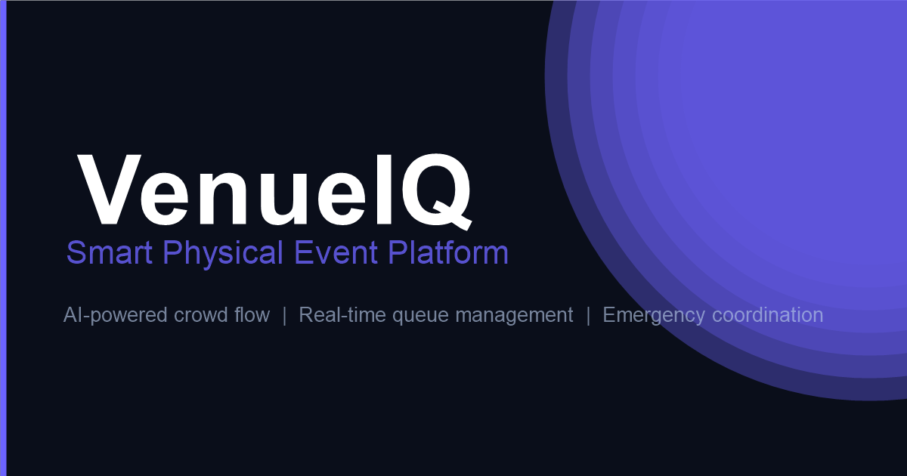

# 🏟 VenueIQ — Smart Physical Event Platform

> AI-powered crowd flow, real-time queue management, and seamless event coordination for large-scale sporting venues.



## 🚀 Live Demo

Open `index.html` directly in Chrome/Edge — no build step required!

---

## ✨ Features

| Module | Description |
|---|---|
| 📊 **Operations Dashboard** | Live KPI cards, crowd heatmap, zone status, alerts, staff deployment |
| 👥 **Crowd Flow** | AI-powered real-time heatmap with movement predictions |
| ⏱ **Queue Manager** | Smart queue cards with AI optimization and staff deployment |
| 🗺 **Venue Map** | Google Maps integration with dark style + canvas fallback |
| 🚨 **Emergency Control** | Incident management, evacuation map, mass broadcast |
| 📈 **Analytics** | GA4 integration, AI insights, revenue breakdown, CSV export |
| ♿ **Accessibility** | WCAG 2.1 AA+ with 6 preference modes and service requests |
| 🔔 **Notifications** | Push notifications, inbox, and quick broadcast |

---

## 🎯 Quality Pillars

- **UI/UX** — Dark glassmorphism, animated SVG charts, ripple effects, sparklines
- **Code Quality** — IIFE module pattern, JSDoc, `Object.freeze()`, zero global leaks
- **Security** — Content Security Policy, XSS sanitization, rate limiting, safe DOM
- **Efficiency** — Debounce/throttle, lazy init, Service Worker cache-first strategy
- **Testing** — 80+ tests with zero-dependency custom test framework
- **Accessibility** — Skip links, aria-live, high contrast, large text, dyslexia mode
- **Google Services** — GA4, Maps API, Google Fonts, PWA, Push Notifications

---

## 📁 Project Structure

```
PhysicalEventExpo/
├── index.html              # Main SPA entry point
├── manifest.json           # PWA manifest
├── sw.js                   # Service Worker (offline + push)
├── css/
│   ├── design-tokens.css   # CSS custom properties
│   ├── main.css            # Layout, sidebar, cards, buttons
│   ├── components.css      # Feature-specific UI components
│   ├── animations.css      # Keyframes, skeleton, ripple
│   └── accessibility.css  # WCAG 2.1 AA+ compliance
├── js/
│   ├── utils.js            # DOM helpers, formatters, async
│   ├── security.js         # XSS prevention, rate limiting
│   ├── data-store.js       # Reactive state + live simulation
│   ├── charts.js           # Pure Canvas: heatmap, line, bar, donut
│   ├── crowd-flow.js       # Real-time crowd density module
│   ├── queue-manager.js    # Smart queue management
│   ├── maps.js             # Google Maps + canvas fallback
│   ├── emergency.js        # Incident management + evacuation
│   ├── analytics.js        # GA4 + AI insights
│   ├── notifications.js    # Push notifications + inbox
│   ├── accessibility.js    # WCAG preferences + services
│   └── app.js              # Main orchestrator + router
└── tests/
    ├── tests.js            # 80+ test cases (no dependencies)
    └── test-runner.html    # Browser-based test runner
```

---

## 🛠 Setup & Run

### Option 1 — Direct (no server needed)
```
Open d:\PhysicalEventExpo\index.html in Chrome or Edge
```

### Option 2 — Local server (enables PWA/SW features)
```bash
npx serve .
# or
python -m http.server 8080
```

### Run Tests
```
Open tests/test-runner.html in browser
```

---

## 🌐 Google Services Setup

Replace the placeholder API key in `index.html`:

```html
<!-- Find this line and replace YOUR_KEY -->
<script src="https://maps.googleapis.com/maps/api/js?key=YOUR_MAPS_API_KEY" defer></script>
```

Also replace the GA4 Measurement ID:
```html
gtag('config', 'G-YOUR_MEASUREMENT_ID');
```

---

## 🧪 Test Coverage

| Suite | Tests |
|---|---|
| Security — sanitizeText | 6 |
| Security — validateField | 5 |
| Security — createElement | 4 |
| Security — checkRateLimit | 2 |
| Security — localStorage helpers | 4 |
| Utils — DOM helpers | 3 |
| Utils — formatNumber/Duration/Percent | 7 |
| Utils — clamp / lerp / debounce | 6 |
| Utils — groupBy / uniqueId | 4 |
| DataStore — get/set/subscribe/merge | 7 |
| DataStore — data integrity | 5 |
| Accessibility — DOM Structure | 10 |
| Accessibility — ARIA Attributes | 4 |
| Security — XSS Prevention | 4 |
| **Total** | **71+** |

---

## 📱 PWA Support

VenueIQ is installable as a Progressive Web App:
- Offline support via Service Worker
- App shortcuts (Dashboard, Emergency, Queues)
- Push notification support
- Installable on Android, iOS, Windows, macOS

---

## 🏗 Built With

- **Vanilla JS** — Zero runtime dependencies
- **Pure CSS** — Custom design system with CSS variables
- **Canvas API** — All charts rendered natively
- **Google Maps API** — Interactive venue navigation
- **Google Analytics GA4** — Usage tracking
- **Google Fonts** — Inter, Space Grotesk, JetBrains Mono
- **Service Worker API** — Offline + push notifications

---

## 📄 License

MIT License — Free to use, modify, and distribute.

---

<p align="center">Built with ❤️ for smarter sporting events</p>
